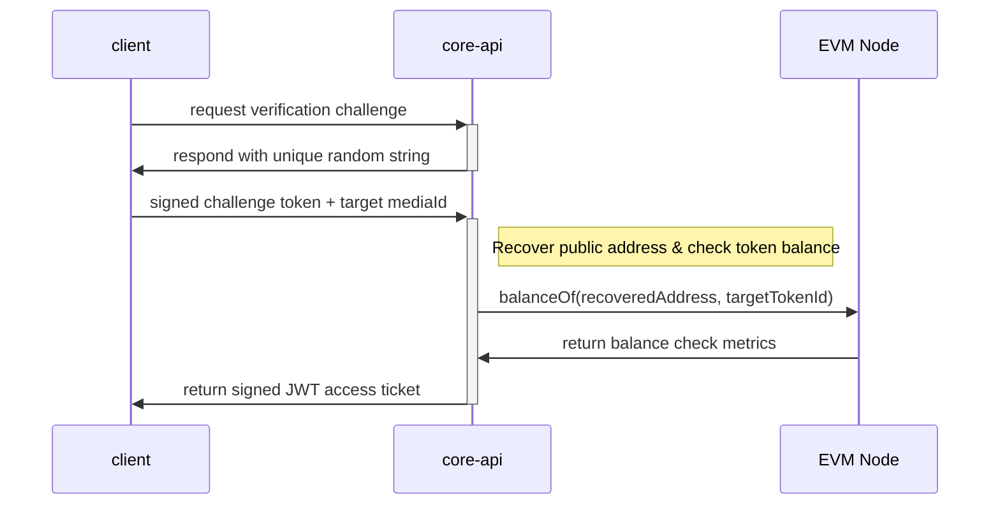

# Cryptographic Media Delivery Protocol Specification

This document provides the authoritative technical specification for the media encoding, asset gating, and fragment decryption protocol. Compliance with these structural definitions is REQUIRED to maintain compatibility across custom stream encoders, decentralized storage distribution layers, and media players.

The key words "MUST", "MUST NOT", "REQUIRED", "SHALL", "SHALL NOT", "SHOULD", "SHOULD NOT", "RECOMMENDED", "MAY", and "OPTIONAL" in this document are to be interpreted as described in RFC 2119.

---

## 1. Architectural Blueprint

The protocol orchestrates a trust-minimized, token-gated digital rights management (DRM) layer by binding distributed file architectures (IPFS), adaptive bit-rate manifests (HLS), and EVM token balances (ERC-721/1155) into an automated validation loop.

It relies on three main decoupled system components:

```text
  ┌───────────────────────┐       ┌───────────────────────┐       ┌───────────────────────┐
  │     Storage Layer     │       │    Decryption Node    │       │     Media Player      │
  │        (IPFS)         │       │      (core-api)       │       │       (client)        │
  └───────────┬───────────┘       └───────────┬───────────┘       └───────────┬───────────┘
              │                               │                               │
              ▼                               ▼                               ▼
    Hosts encrypted content         Enforces wallet limits          Automates handshake
    & canonical rair.json           & serves manifest keys          & decrypts chunk array

```

### Distributed Storage Layer (IPFS)

Encoded and encrypted media artifacts are pinned across decentralized nodes. This approach avoids central cloud dependancy bottlenecks and shifts data delivery limits straight to network edges. Content providers are explicitly responsible for maintaining file visibility and pinning status targets.

### Decryption Layer (`core-api`)

The decryption gateway serves as the zero-trust intermediary gatekeeper. Instead of attempting to stream direct files out of public IPFS nodes, the viewer proxies verification checks through this layer. The system stores structural symmetric keys securely and evaluates on-chain state balances before releasing stream keys.

The decryption engine **MUST ONLY** distribute manifest mapping tokens to callers proving active ownership control over an explicit Ethereum private key linked to a qualifying balance.

### Player Core (`client`)

The runtime media player initiates standard adaptive bitrate adjustments across HLS streams. It natively overrides connection hooks to handle automated challenge/response handshakes and passes short-lived validation metadata securely inside headers.

---

## 2. Ingestion & Media Encoding Specs

All media targets hosted through this framework **MUST** be processed into compliance with the [HTTP Live Streaming (HLS) RFC 8216](https://tools.ietf.org/html/rfc8216) specification layer. The uploaded directory mapping **MUST** host a primary configuration index (`master.m3u8` or `main.m3u8`) alongside its corresponding downstream media files (`.ts` segments).

### Canonical Indexing (`rair.json`)

The root distribution folder **MUST** bundle a flat configuration manifest named `rair.json` to define index tracking metadata. It **MUST** match the following structural JSON Schema definition:

```json
{
  "type": "object",
  "properties": {
    "name": {"type": "string"},
    "author": {"type": "string"},
    "description": {"type": "string"},
    "nftIdentifier": {
      "type": "string",
      "description": "Token filter requirement array formatted strictly as: <contractAddress>:<tokenIdIndex>"
    },
    "encryption": {
      "type": "string",
      "enum": ["aes-128-cbc", "none"]
    },
    "mainManifest": {
      "type": "string",
      "description": "Target path mapping reference for primary manifest file. E.g., master.m3u8"
    }
  },
  "required": ["name", "nftIdentifier", "encryption", "mainManifest"]
}

```

### Symmetric Encryption Rules

Symmetric file obfuscation is handled at the file chunk boundary before pushing to decentralized storage systems.

* File segment processing **MUST** use the **AES-128** specification configuration in **Cipher Block Chaining (CBC)** mode.
* Only the raw payload video chunk partitions (`.ts` file extensions) **SHALL** be processed via the cipher loop.
* The explicit Initialization Vector (IV) calculated per chunk **SHALL** map to the integer sequence index of the segment, encoded as an unsigned integer padded to a **16-byte little-endian** array format.

---

## 3. Cryptographic Handshake Protocol

To acquire time-limited stream tokens, the execution interface coordinates a multi-step signature verification sequence with the `core-api` backend container layout:



To maintain execution compliance, the `core-api` gateway engine **MUST** expose and support these canonical validation interfaces:

### 1. Challenge Provisioning

* **HTTP Method**: `GET`
* **Route Target**: `/api/auth/challenge/:eth_address`
* **Description**: Evaluates the parameters of an input Base64 or Hex encoded public wallet identifier and responses with an isolated, cryptographically secure random challenge payload.

### 2. Signature Validation & Ticket Issuance

* **HTTP Method**: `POST` / `GET`
* **Route Target**: `/api/auth/verify` (or mapped endpoint parameters)
* **Payload**: Includes target transaction challenge payload string, cryptographic signature verification block, and the unique `mediaId` string lookup.
* **Output**: Validates transaction validity via elliptic curve address recovery utilities. Upon asserting positive on-chain token balance positions, delivers an encrypted, short-lived JWT authorization ticket payload.

### 3. Media Streaming Proxy

* **HTTP Method**: `GET`
* **Route Target**: `/stream/:token/:media_id/*path`
* **Description**: Processes chunk transmission parameters. Evaluates incoming token authenticity states against internal request mapping metrics. Blocks file deliveries immediately upon ticket expiration or validation signature discrepancies.

---

## 4. Token Ownership Verifications

The validation layer guarantees trust-minimized gatekeeping by querying on-chain states directly. It parses `nftIdentifier` settings arrays fetched out of the internal `rair.json` file configurations, makes cross-network JSON-RPC execution inquiries against matching `balanceOf(account, tokenId)` data bindings, and locks token issuance handlers if return balances register a flat zero position.